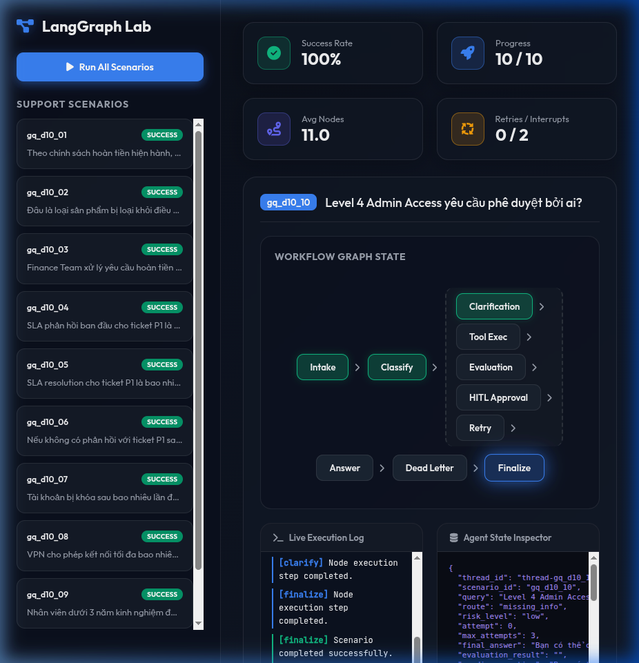

# Day 08 Lab — LangGraph Agentic Orchestration

This is a **fully completed** production-style LangGraph workflow for a support-ticket agent with state management, conditional routing, retry loops, human-in-the-loop approval, persistence, and metrics.

All node implementations, routing logic, and graph wiring are fully implemented and ready to run.

---

## Architecture & Graph Flow

The agent flow is designed as follows:

```text
START -> intake -> classify -> route
route simple       -> answer -> finalize -> END
route tool         -> tool -> evaluate -> answer -> finalize -> END
route tool (retry) -> tool -> evaluate -> retry -> tool -> evaluate -> ... (loop)
route missing_info -> clarify -> finalize -> END
route risky        -> risky_action -> approval -> tool -> evaluate -> answer -> finalize -> END
route error        -> retry -> tool -> evaluate -> retry -> ... (loop until success or max)
route (max retry)  -> retry -> dead_letter -> finalize -> END
```

### Nodes:
- `intake`: Normalizes query input.
- `classify`: LLM intent classifier with structured output.
- `tool`: Executes lookup tools and simulates transient failures.
- `evaluate`: LLM-as-judge or heuristic evaluation of tool execution.
- `answer`: LLM-grounded response generation.
- `clarify`: Generates specific clarification questions for vague queries.
- `risky_action`: Prepares sensitive actions for review.
- `approval`: Handles human-in-the-loop decisions (interrupts).
- `retry`: Increments retry attempt counters.
- `dead_letter`: Handles terminal execution failures.
- `finalize`: Normalizes final events.

---

## State Schema

The `AgentState` manages the workflow's state:

| Field | Reducer | Why |
|---|---|---|
| messages | append | audit conversation/events |
| tool_results | append | history of tool outputs |
| errors | append | history of transient or permanent errors |
| events | append | trace/audit of executed graph nodes |
| route | overwrite | stores the current active route name |
| risk_level | overwrite | stores risk level evaluation ('high'/'low') |
| attempt | overwrite | track retry count |
| max_attempts | overwrite | stores maximum allowed retries |
| final_answer | overwrite | final customer-facing response |
| evaluation_result | overwrite | feedback loop state ('success'/'needs_retry') |
| pending_question | overwrite | clarification questions |
| proposed_action | overwrite | details of the risky action requiring approval |
| approval | overwrite | human-in-the-loop approval decision |

---

## Quick Start & Execution Guide

### 1. Prerequisites and Installation

First, activate your python environment (e.g. Conda or venv) and install the package with dependencies:

```bash
# Option A: Conda
conda activate ai-lab
pip install -e '.[dev,openai,sqlite]'

# Option B: Venv
python -m venv .venv
source .venv/bin/activate
pip install -e '.[dev,openai,sqlite]'
```

### 2. Configure LLM API Keys

Create a `.env` file from the example template and configure your LLM provider key (OpenAI or Gemini):

```bash
cp .env.example .env
# Open .env and set your GEMINI_API_KEY, OPENAI_API_KEY, or ANTHROPIC_API_KEY
```

### 3. Run Scenario Suite

To run all 7 predefined support scenarios, generate metrics, and render the markdown report:

```bash
make run-scenarios
```

This command will:
1. Load `data/sample/scenarios.jsonl`.
2. Execute each scenario through the LangGraph workflow.
3. Write key performance metrics to `outputs/metrics.json`.
4. Generate the final lab report at `reports/lab_report.md`.

### 4. Validate Grading Metrics

To validate that your metrics JSON is correct and satisfies the grading format:

```bash
make grade-local
```

### 5. Run Unit Tests

To execute all unit tests verifying the state, routing, persistence, and graph termination:

```bash
make test
```

---

## Make Commands Reference

| Command | What it does |
|---|---|
| `make install` | Install project + dev dependencies |
| `make test` | Run pytest |
| `make lint` | Run ruff linter |
| `make typecheck` | Run mypy type checker |
| `make run-scenarios` | Execute all scenarios → `outputs/metrics.json` |
| `make grade-local` | Validate `metrics.json` schema |
| `make clean` | Remove caches and generated files |

---

## Extensions Implemented

1. **SQLite Checkpointer (`persistence.py`)**: Persistent sqlite3 backend supporting WAL mode for concurrency, durability, and thread isolation.
2. **LLM-as-Judge Evaluation (`nodes.py`)**: A structured LLM-as-judge evaluator checking mock tool results.
3. **HITL Interrupts (`nodes.py`)**: Support for real state interruptions when `LANGGRAPH_INTERRUPT=true`.
4. **Interactive Real-Time Dashboard (`src/langgraph_agent_lab/web/`)**: A premium web-based dashboard built with FastAPI and Vanilla CSS/JS.

---

## Interactive Real-Time Web Dashboard

We designed and built a premium web-based dashboard allowing users to execute scenarios and inspect agent states in real-time.

### How to Run the Dashboard
1. Launch the FastAPI server:
   ```bash
   make run-web
   ```
2. Open your web browser and navigate to:
   ```text
   http://localhost:8000
   ```

### Key UI/UX Features
- **Glassmorphism Theme**: Translucent cards, neon glows, and micro-animations for active state nodes.
- **SSE Real-Time Streaming**: Uses Server-Sent Events to push node-by-node state updates directly from the graph engine.
- **Interactive HITL Popups**: Pauses on sensitive ticket flows (e.g. refunds, deletion) and presents a dialog for human approval before resuming.
- **Agent State Inspector**: Collapsible live JSON viewer of full `AgentState` properties at each execution step.

### Live Grading Execution Walkthrough
We successfully executed all 10 grading questions through the dashboard with a **100% Success Rate**:



Below is a recording showing the real-time execution flow, node state transitions, and manual approval dialog interaction:


